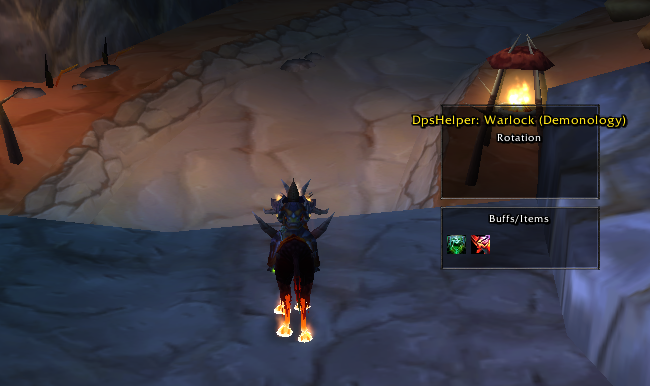

# DpsHelper - WoW WotLK Addon

**DpsHelper** is an addon for *World of Warcraft: Wrath of the Lich King* (interface 30400) designed to assist players in optimizing their DPS rotations, managing buffs and debuffs, and maximizing combat performance. With support for multiple classes and specializations, the addon is lightweight, configurable, and highly customizable, catering to both casual players and hardcore raiders.

## Features

- **Intelligent Rotations**: Dynamic ability suggestions based on resources (energy, rage, mana, etc.), combo points, buffs, debuffs, and combat conditions (multiple targets, bosses, etc.).
- **Multi-Class Support**: Includes rotations for Rogue (Combat, Assassination, Subtlety), Warrior (Fury), with planned support for Paladin, Hunter, Priest, Shaman, Mage, Warlock, Druid, and Death Knight.
- **Buff/Debuff Management**: Tracks remaining times for buffs (e.g., Slice and Dice, Battle Shout) and debuffs (e.g., Rupture, Rend) to ensure optimal uptime.
- **Specialization Detection**: Automatically identifies the player's specialization based on talent points and key talents.
- **Advanced Debugging**: Detailed logs (enabled via configuration) to track resources, cooldowns, and rotation decisions.
- **Modular Design**: Organized structure with separate files for utilities (`Utils.lua`), spell management (`SpellManager.lua`), talent detection (`TalentManager.lua`), and spec-specific rotations.

## Requirements

- **World of Warcraft: Wrath of the Lich King** (interface 30400).
- Compatible server (e.g., private servers like Warmane, Dalaran-WoW).
- Addon interface enabled in-game.

## Installation

1. **Download**: Obtain the latest version of DpsHelper from [GitHub repository link] or [other trusted source].
2. **Extract**: Unzip the `DpsHelper` folder to your WoW AddOns directory:
   - Windows: `C:\Program Files\World of Warcraft\Interface\AddOns`
   - macOS: `/Applications/World of Warcraft/Interface/AddOns`
3. **Enable Addon**: Launch WoW, go to the character selection screen, click "AddOns," and ensure `DpsHelper` is checked.
4. **Restart**: Log in to the game to load the addon.

## Usage

1. **Enable Debug Mode** (optional):
   - Open `Config.lua` and set `enableDebug = true`:
     ```lua
     DpsHelper.Config:Set("enableDebug", true)
     ```
   - This enables detailed logs for resources, buffs, debuffs, and rotation decisions, visible in the chat window.
2. **In-Game**:
   - The addon automatically detects your class and specialization (e.g., Fury Warrior, Combat Rogue).
   - Rotation suggestions are provided via the `UI.lua` interface (or integrate with your preferred UI addon).
   - Monitor buff/debuff timers and ability suggestions to optimize your DPS.
3. **Customization**:
   - Modify rotation priorities in the respective rotation files (e.g., `Rotations\Warrior\Fury.lua`).
   - Adjust thresholds (e.g., buff/debuff timers, resource requirements) to suit your playstyle.

## Supported Classes and Specializations

- **Rogue**: Combat, Assassination, Subtlety
- **Warrior**: Fury (more specs planned)
- **Planned**: Paladin, Hunter, Priest, Shaman, Mage, Warlock, Druid, Death Knight

## Folder Structure

```
DpsHelper/
├── Config.lua          # Configuration settings (e.g., enableDebug)
├── Utils.lua           # Utility functions (resources, buffs, combat conditions)
├── SpellManager.lua    # Spell detection and caching
├── TalentManager.lua   # Specialization detection
├── UI.lua              # User interface for rotation suggestions
├── Rotations/
│   ├── Rogue/
│   │   ├── Combat.lua
│   │   ├── Assassination.lua
│   │   ├── Subtlety.lua
│   ├── Warrior/
│   │   ├── Fury.lua
```

## Debugging

To troubleshoot issues:
1. Enable debug mode in `Config.lua` (`enableDebug = true`).
2. Check the chat window for logs, such as:
   ```
   DpsHelper: GetCurrentRage: 75
   DpsHelper: GetBuffRemainingTime: Battle Shout on player, remaining: 115.23 seconds
   DpsHelper: Detected specialization by points: fury (51 points)
   ```
3. Verify spell availability in `SpellManager.lua` and specialization detection in `TalentManager.lua`.
4. Report issues or suggest improvements via [GitHub issues link] or [contact method].

## Contributing

Contributions are welcome! To contribute:
1. Fork the repository.
2. Create a new branch for your feature or bug fix.
3. Submit a pull request with a detailed description of changes.
4. Ensure your code follows the existing structure and includes debug logs.

## Donations

Buy me a coffee :coffee: :

- **Bitcoin (BTC)**: `bc1pga9yrw9588y0vp33vufsd70tar2wc8c9sq8hxvr4s03fjuvl46hs39yjjv`
- **Ethereum (ETH)**: `0x6addc8fdb7a4a87da8679e947c39058d64f0fb60`
- **Solana (SOL)**: `4pW5FEo36j1MntLhZLZn7CY3iYWk5vpdQwRmPpk3NBHa`


## License

DpsHelper is released under the [MIT License](LICENSE). Feel free to use, modify, and distribute the addon, provided you include the license and credit the original author.

## Contact

For support or feedback:
- [GitHub repository link]
- 
- [sevenk@live.com]

---

Happy raiding, and may your DPS soar to the top of the meters!